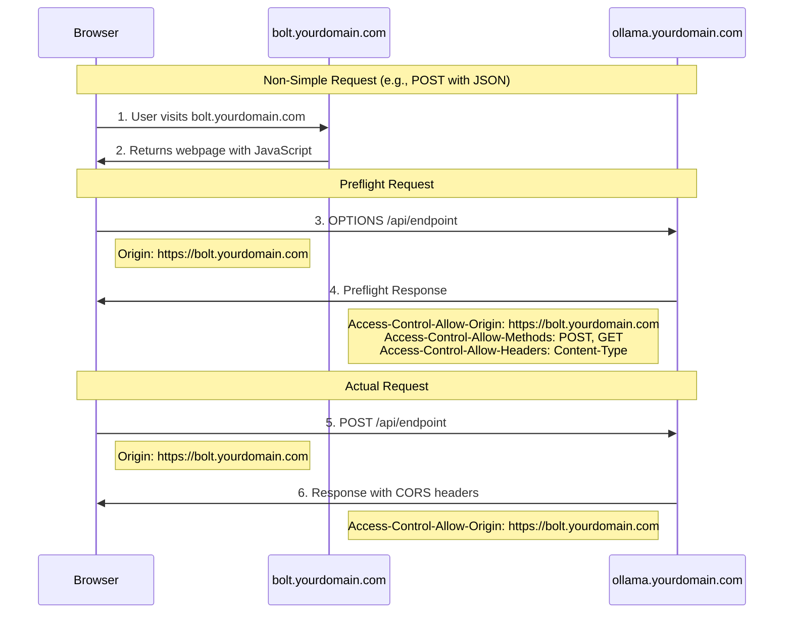

# This is provided as an example only, many options will need changing to suit your enviroment

### Docker Compose Stack 

* Traefik
* Ollama
* Bolt.new

All connected to the same docker network called (proxy) see the exmaple docker-compose.yml as an example

### CORS
I'll explain how CORS works in your specific scenario with https://bolt.yourdomain.com accessing https://ollama.yourdomain.com.

Here's what's happening in detail:

1. User visits https://bolt.yourdomain.com in their browser

2. bolt.yourdomain.com serves the webpage with JavaScript code

3. When the JavaScript code tries to make a request to ollama.yourdomain.com, the browser first sends a preflight OPTIONS request because it's a cross-origin request

4. ollama.yourdomain.com must be configured to respond to the OPTIONS request with appropriate CORS headers

5. If the preflight is successful, the browser sends the actual request

6. ollama.yourdomain.com responds with the data and required CORS headers

To make this work, you need to configure ollama.yourdomain.com to allow requests from bolt.yourdomain.com. on the Ollama container you will need to define this as an enviroment var OLLAMA_ORIGINS